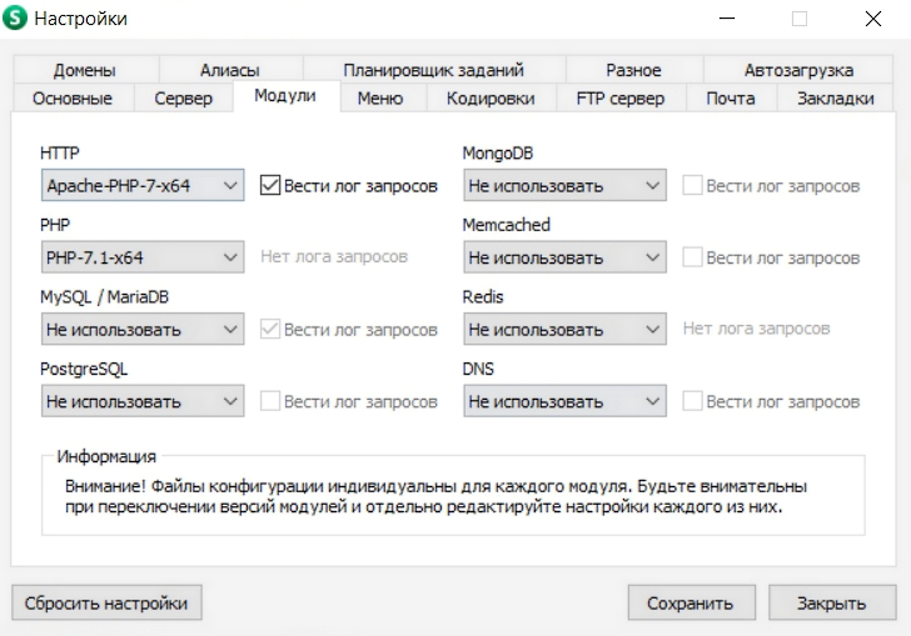

<h1 align="center">NetSchool PTHS</h1>

>  *NB!*    Категорически не рекомендуется пытаться клонировать и запускать код у себя на машине без связи с разработчиками. Во-первых, это непросто, и без помощи будет сложно... Во-вторых, гораздо лучше будет, если Вы напишите в поддержку, присоединитесь к команде и сделаете это в ее составе. В-третьих, доступа к телеграмм-боту (баг-репорт) и базе данных этот репозиторий не дает, для его полной "комплектации" нужен еще один конфигурационный файл, доступ к которому (= доступ к паролям всех пользователей) есть только у разработчиков.
>
>  Однако ознакомиться с кодом (перед тем, как, например, вступать в команду) может каждый желающий.

[TOC]

## Инструкция по запуску на локальной машине (для членов команды)

Далее предполагается, что у Вас Windows 7/10, есть базовые навыки установки всего подряд, ручного прописывания путей, работы с git и т.д. Если вы линуксоид — то Вам запустить сервер у себя на порядок проще, и за Вас беспокоиться не надо, поэтому инструкцию не приводим (сами разберетесь, не впервой). Если Mac — ... Ну, потыкайтесь, но, скорее всего, это fail.

### Требования:

-  OpenServer. Проще всего скачать с [официального сайта](https://ospanel.io/download/) (хотя там скорость маленькая, но приемлемая). После установки нужно убедиться, что модули настроены следующим образом (или аналогичным, зависит от версии, например, версия apache может называться Apache_2.4-PHP_7.0-7.1):

   

-  Node.js (npm), базовая вещь, качается откуда угодно (для windows 7 последняя версия не поддерживается, в этом случае нужно качать <= v13.14.0).

-  php нужной версии должен быть прописан в path

### Шаги

1. `git clone` проекта в подпапку `C:\OpenServer\domains`, назвав ее `netschool.loc` (это важно).

2. CMD: `npm install --global gulp-cli` (если не установлен)

3. CMD (на несколько директорий выше корня проекта): `npm install gulp`

4. CMD (в корне проекта): `"src/config/install_node.cmd"` (Windows) или `sh ./src/config/install_node.sh` (Linux)

5. Запустить `gulp deploy` или `gulp build`

6. Получить конфигурационный файл от команды разработчиков с инструкциями, куда и как его положить.

7. Запустить OpenServer от имени администратора, далее "Запустить" (иконка в нижней части экрана).

8. Открыть в браузере `netschool.loc` и наслаждаться тем, что все работает (скорее всего нет, и нужно выяснять индивидуально, но вдруг).

9. Рекомендуется (не обязательно, но желательно, если вы не любите много жмякать по <kbd>Ctrl+F5</kbd>) установить плагин `livereload` (есть на Firefox и Chrome, если на Ваш браузер нет — гораздо проще обойтись без него, нежели пытаться что-то самим химичить).

## Работа с кодом

Редактируя код, желательно иметь запущенный `gulp`  (профиль `default`; желательно в консоли, отдельной от той, где ведется работа) — он будет автоматически собирать проект, это быстрее, чем каждый раз, тестируя проект, собирать (`gulp build`) проект целиком. Если установлен и включен livereload.js на браузер, то это также будет автоматически обновлять страницу браузера, сводя затрачиваемое время разработчика на сборку и обновление к нулю. Без плагина нужно каждый раз жестко перезагружать страницу, когда нужно понять, как оно будет выглядеть.

Если вдруг Вы в первый раз сталкиваетесь с разработкой сайтов (будет сложно, но при хорошей эрудиции — не критично), то стоит уделить должное внимание отладчику ("инспектор", "просмотр кода элемента", "исследовать элемент" и т.д.). Незаменимая вещь при работе с версткой и js (и не только).

Если нужно "избавиться" от ненужных файлов в build, вызывается команда `gulp clean`. Это полезно, например, для переключения на другую ветку проекта.

### Структура проекта

При сборке файлы `.php`, `.js`, `.scss` сжимаются для уменьшения количества передаваемых данных (и, следовательно, более быстрой загрузки страницы). В каждой из папок с кодом есть подпапка `build`, куда собираются файлы  `.js` и `.scss`. Там они "превращаются" в файлы `.min.js` и `.min.css` соответственно ("минифицированные"), которые только и должны обрабатываться браузером. Сжимаемые файлы `.php` и `.html` должны называться `.max.php` и `.max.html`, и сжимаются они в ту же папку, где они и находятся.

Таким образом, важны (и должны редактироваться) только файлы `.js` (без `.min`), `.scss`, `.max.php`, `.max.html`.

Главная страница находится в корне проекта, основные разделы — в подпапках корня. В папке `src` находится основная логика сайта, общая для всех разделов. В частности — библиотеки (`src/lib`) и общие для всех стили (`src/styles`). В папке `files` — шрифты, иконки, картинки... В общем, структура ± интуитивно понятна.

Если добавляется новый раздел / меняется структура старого, файл gulpfile.js должен быть изменен, чтобы соответствовать файлам, которые нужно сжать или убрать. Для этого меняются строки вида `files['<имя расширения/clean>'].push('<путь к папке>/*.<имя расширения>');`

→ to be continued
